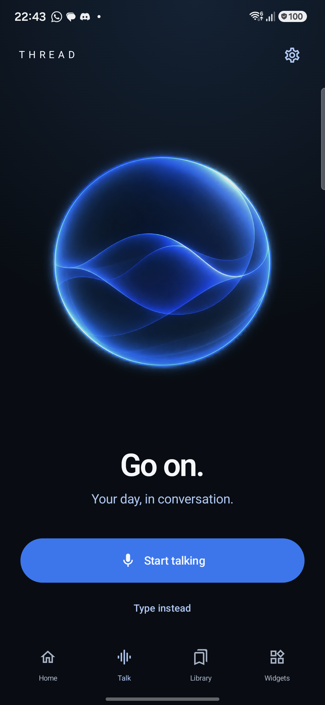
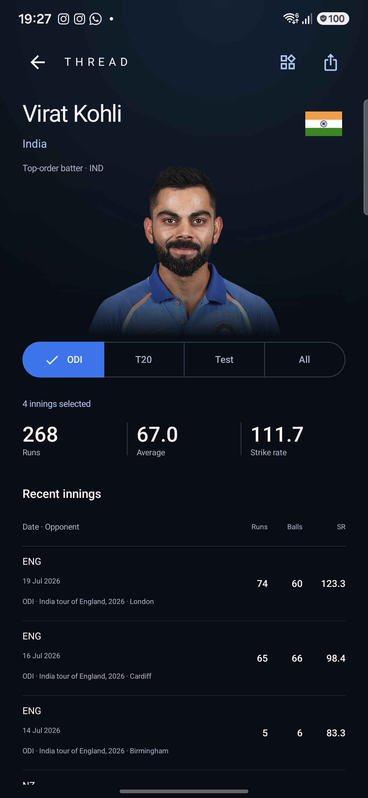
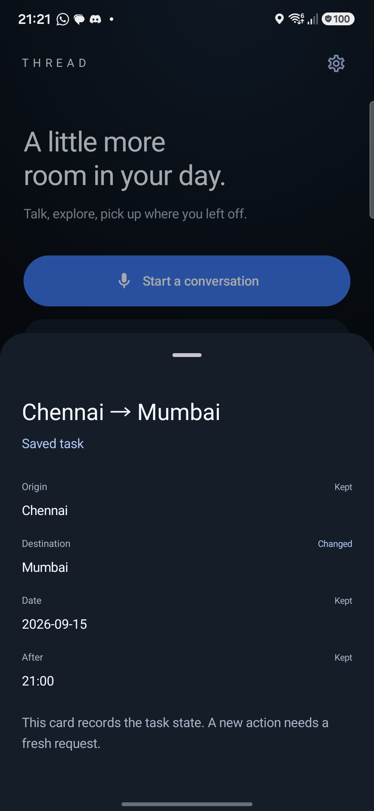

<p align="center">
  
</p>

<h1 align="center">THREAD</h1>

<p align="center"><strong>Ask. Interrupt. Keep going.</strong></p>
<p align="center">A voice assistant that keeps the task consistent when the conversation changes.</p>

<p align="center">
  <a href="docs/START_HERE.md">Product tour</a> ·
  <a href="docs/RUN.md">Setup</a> ·
  <a href="docs/CODE_MAP.md">Architecture</a> ·
  <a href="docs/WHAT_WORKS.md">Capabilities</a> ·
  <a href="docs/VALIDATION.md">Validation</a>
</p>

THREAD combines a native Android app, real-time voice, useful result cards, and a shared task engine. When a user interrupts a request, it updates the work behind the answer: retaining relevant details, rejecting obsolete results, and checking whether an action still has current permission.

**Android 0.6.0 · Android 12+ · Python 3.11 · Samsung PRISM Theme 05 prototype**

This repository contains the application source, browser client, Android project, required runtime assets, tests, evaluation fixtures, and production sources for the product film. It also includes a guided starting point for the four-person team.

## The interaction

> **User:** Find flights from Chennai to Delhi, tomorrow after nine.
>
> **User, while the search is running:** Actually Mumbai. Keep the date and time.
>
> **THREAD:** Updates the destination, retains the other constraints, and prevents the obsolete Delhi result from taking over.

The flight service uses fictional inventory. The controller behavior is implemented: a correction can supersede pending work and revoke permission for an unsubmitted action. Already-submitted effects remain tracked until their outcomes are known.

## Android experience

<p align="center">
  
  
  
</p>

Actual development-device captures. The sports screen displays a captured result; the travel screen shows a fictional scenario. See [capture provenance](motion/assets/screens/provenance.json).

## Capabilities

| Area | Implemented behavior |
|---|---|
| Conversation | Gemini Live audio, local Silero speech detection, interruption handling, typed requests, and an active voice dock alongside results. |
| Task control | Constraint retention, revision-aware cancellation, current-result validation, explicit action authorization, duplicate protection, and outcome reconciliation. |
| Useful results | Weather, sports, web/news discovery, research sources, arithmetic, unit and currency conversion, dates, clocks, documents, and notes. |
| Personal workspace | Local Library, saved notes, persistent checklists, and home-screen widgets composed from supported results. |
| Android actions | Google search-tab handoffs, app opening, Clock, Maps, dialer, message/email/calendar drafts, media volume, and permissioned flashlight. |
| Phone runtime | Shared Python backend embedded in the Android app; private configuration encrypted with Android Keystore. |
| Evaluation | Queue/JSONL adapter, deterministic timing replays, authored multimodal fixtures, provider checks, and native-device tests. |

See [capability status](docs/WHAT_WORKS.md) for exact coverage. Spotify personal playback is implemented but awaits real account integration verification. Flights, room reservations, and device-support services are explicitly simulated. New Gemini requests and fresh public data require internet and available quota.

## Quick start

### Browser workspace · Windows

Install Python **3.11**, then:

```powershell
git clone https://github.com/anshcantcode/thread-team-guide.git
cd thread-team-guide
py -3.11 -m venv .venv
.\.venv\Scripts\python.exe -m pip install -r requirements.lock
Copy-Item .env.example .env
notepad .env
```

Set `THREAD_API_KEY` locally, then run:

```powershell
.\run.ps1
```

Open **http://127.0.0.1:8766/**. Start with **Type instead**, or choose **Start talking** and allow microphone access. Use `stop-thread.ps1` to stop the desktop server. Copy `.env.example` only on first setup; preserve any existing `.env`.

For a POSIX shell, use `python3.11 -m venv .venv`, activate it, install the same lockfile, and copy `.env.example` to `.env`. After configuration, run:

```sh
python -m uvicorn thread_agent.server:app --host 127.0.0.1 --port 8766
```

### Android

Open `android/` in Android Studio. The project targets SDK 36, requires JDK 17+ and Python 3.11 for the embedded runtime, and supports Android 12+. Sync the Gradle wrapper before using the Windows helper:

```powershell
.\android\gradlew.bat --version
.\scripts\build-android.ps1 -Release -Install
```

Installation requires an authorized USB-debugging device. On a fresh phone, enter a Gemini key in THREAD Settings. Normal use runs through the phone's embedded backend and its own internet connection. The review build uses a development signing key; see [Android setup](android/README.md) before upgrading an existing installation.

Full prerequisites, provider configuration, troubleshooting, and device-check instructions are in [Setup](docs/RUN.md).

## Architecture

```text
Android UI + local speech detection       Browser UI + audio
                 |                                |
       Embedded Python backend            Desktop backend
                 +---------------+----------------+
                                 |
                    Live voice / interpretation
                                 |
                 Task state + action authorization
                                 |
              Tools, providers, and outcome tracking
                                 |
                  Voice, cards, Library, widgets
```

The model proposes interpretations. Deterministic state and authorization checks own the current task, valid result identifiers, and permission to execute effects. The provisional Theme 05 adapter uses the same engine through asynchronous event/action queues.

| Directory | Responsibility |
|---|---|
| [`thread_agent/`](thread_agent/) | Controller, voice sessions, providers, schemas, and embedded backend. |
| [`android/`](android/) | Kotlin/Compose app, audio, native actions, widgets, and device tests. |
| [`web/`](web/) | Browser client, audio worklets, result renderers, fonts, and interface assets. |
| [`tests/`](tests/) | Python and JavaScript regression checks. |
| [`scripts/`](scripts/) | Build, verification, data-fixture, and packaging utilities. |
| [`evaluation/`](evaluation/) | Authored task manifests, multimodal fixtures, and trace-viewer template. |
| [`docs/`](docs/) | Team onboarding, code map, validation, and delivery plan. |
| [`design/`](design/) | Selected interaction reference boards, labelled separately from actual UI. |
| [`motion/`](motion/) | Editable film scripts, renderers, sound production, and attributed assets. |

Start with the [code map](docs/CODE_MAP.md) to follow a request through the system.

## Verification

These checks require installed dependencies but no API key:

```powershell
.\.venv\Scripts\python.exe -m unittest discover -s tests -q
node tests/audio-check.mjs
node tests/live-audio-check.mjs
node tests/workspace-check.mjs
.\.venv\Scripts\python.exe scripts/check_theme5.py --seeds 50
```

The replay checks six scenario families over 50 timing seeds, including stale results, corrected selections, unknown outcomes, replaced media, and preempted interpretation. Its scripted inputs measure controller behavior, not language-model accuracy or physical microphone latency.

[Validation](docs/VALIDATION.md) distinguishes clean-checkout checks, recorded device evidence, and remaining work. The [CI workflow](.github/workflows/ci.yml) runs backend/browser checks and an Android build without production credentials. Live-provider and physical-device checks are opt-in.

## Team workflow

Read [Start here](docs/START_HERE.md), choose a path in [Code map](docs/CODE_MAP.md), then follow [Contributing](CONTRIBUTING.md). The [team plan](docs/TEAM_PLAN.md) keeps responsibilities and the technical demonstration aligned with the core interruption problem.

The [Theme 05 contract](EVALUATION.md) is provisional until checked against the organizer's exact kit. The [product specification](THREAD_Product_Specification.md) and [roadmap](docs/ROADMAP.md) describe direction; neither should be read as a list of completed integrations.

## Assets and licensing

Bundled models, fonts, imagery, and generated media are documented in [Third-party notices](THIRD_PARTY_NOTICES.md). Their original notices remain included. A project-wide redistribution license has not been selected.
