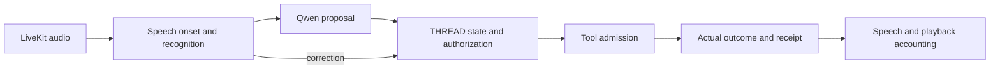

<p align="center"></p>
<h1 align="center">THREAD</h1>
<p align="center"><strong>Go on.</strong><br>A voice assistant you can interrupt and correct without losing the task.</p>

<p align="center"><a href="docs/TOUR.md">Try THREAD</a> · <a href="docs/SETUP.md">Install</a> · <a href="docs/ARCHITECTURE.md">Architecture</a> · <a href="docs/submission/RESULTS.md">Results</a> · <a href="docs/submission/README.md">Submission</a></p>

**Samsung PRISM 2026 · Theme 05: Interruptible Real-Time Agents**
Team **ReflexAi**, SRM Institute of Science and Technology Kattankulathur.
**Version 1.0.0 · Python 3.11 · Android 12+ · Browser**

THREAD keeps a request's state as the user changes it. A correction invalidates obsolete work, retains relevant constraints and checks which actions still have permission to execute. If an action has already reached a tool, THREAD tracks its actual outcome instead of pretending an interruption undid it.

> “Add two. Actually, one.”
>
> Before dispatch, only the surviving authorized quantity may run. After dispatch, a receipt records what actually happened. An unknown write is reconciled before any retry.

## Start here

Download the [submission release](https://github.com/anshcantcode/thread-team-guide/releases/tag/PRISM_GENAI_HACKATHON_Y2026). It contains the Android APK, browser bundle, source archive, complete portable evidence, presentation, media and SHA-256 checksums. All assets refer to the same release; the evidence retains its original measured source identities.

1. Follow [setup](docs/SETUP.md) to start the local planner and Kitchen host.
2. Open the browser at **http://127.0.0.1:8768**, or install the APK and choose **Settings → Open Kitchen**.
3. Follow the [five-minute product tour](docs/TOUR.md): make a real checklist change, inspect its receipt and read it again after reopening the client.

Kitchen uses local models and speech with no API key. The host runs on the computer; the Android client connects through explicit ADB reverse. Model downloads, CUDA/cuDNN prerequisites and the organizer dataset are separate from the release. The original Gemini app mode remains available with separately configured credentials.

## How it works

The FDB-v3 path carries real audio through LiveKit, local Whisper `small.en`, a Qwen3.5-4B planner, THREAD's controller, the actual tool boundary and local speech. The planner proposes an action; current state, clause authority and execution checks decide whether it can run.


```mermaid
flowchart LR
  A[LiveKit audio] --> B[Speech onset and recognition]
  B --> C[Qwen proposal]
  C --> D[THREAD state and authorization]
  D --> E[Tool admission]
  E --> F[Actual outcome and receipt]
  F --> G[Speech and playback accounting]
  B -->|correction| D
```

The **Kitchen extension** connects the same controller to real browser and Android checklist storage. Its three tools read, add and update items. Session/request identities and durable idempotency receipts protect the client boundary. Its PCM WebSocket transport is distinct from benchmark LiveKit WebRTC. [Architecture and code map →](docs/ARCHITECTURE.md)

## Evaluation

The selected execution path has a complete historical **61/100 strict tool-pass** result at source `8dd530f`: **100 recordings evaluated, zero infrastructure errors**. A separately pinned larger-recognizer experiment scored **64/100** at source `771981a`. Both use a local Qwen diagnostic judge; Samsung's organizer rerun determines the official score.

The final source integrates the measured general controller fixes and repaired client wiring. Matching runtime hashes are documented, but the integrated release does not inherit a fresh full-run result. Three fresh 100/100 runs have not been achieved. All failures remain in the published evidence. [Results, provenance and limits →](docs/submission/RESULTS.md)

## Reproduce the benchmark

After installing the declared Linux/Python 3.11, NVIDIA CUDA/cuDNN, FFmpeg, espeak-ng and LiveKit prerequisites:

```bash
export THREAD_FDB3_ARCHIVE=/absolute/path/fdb_v3_data_released.zip
export LIVEKIT_SERVER=/absolute/path/livekit-server
bash scripts/reproduce_fdb3_linux.sh
```

This entry point installs and configures isolated environments, verifies pinned data/model identities, runs fresh inference and invokes the evaluators. Local judging is the default. Read [the full reproduction procedure](docs/fdb3/REPRODUCE.md) for pins, optional existing assets, exit codes and the unqualified full Linux/GPU gate. No hosted spending is enabled by these instructions.

## Submission materials

| Material | Location |
|---|---|
| Product tour and exact setup | [Tour](docs/TOUR.md), [setup](docs/SETUP.md) |
| Architecture and implementation | [Architecture](docs/ARCHITECTURE.md) |
| Eight-slide presentation | [SRMISTKtr_ReflexAI.pptx](docs/submission/SRMISTKtr_ReflexAI.pptx) |
| Latest launch film | [THREAD_Launch_Film.mp4](https://github.com/anshcantcode/thread-team-guide/releases/download/PRISM_GENAI_HACKATHON_Y2026/THREAD_Launch_Film.mp4), animated companion with disclosed re-voiced replies |
| Recorded demonstration | [THREAD_Recorded_Demo.mp4](docs/submission/media/THREAD_Recorded_Demo.mp4), edited historical benchmark and native extension evidence |
| Measured results and test receipts | [Results](docs/submission/RESULTS.md), release evidence archive |
| Team, required disclosure and submission status | [Submission index](docs/submission/README.md) |

The launch film illustrates recorded evidence and product concepts. The separate demo preserves original benchmark/agent audio and actual extension screen capture with source labels. Neither is presented as a continuous live capture of the final release. See [media provenance](docs/submission/media/README.md).

## Development

Run the provider-free Python and browser checks from [setup](docs/SETUP.md#build-and-test). Android's Gradle build embeds a per-file Python source manifest. Release verification compares those hashes with this checkout and verifies the APK signature. The native history screen retains the latest 50 conversations.

| Path | Responsibility |
|---|---|
| `participant/` | Task state, planner proposals, clause authorization and write accounting |
| `thread_agent/fdb3*.py` | LiveKit adapter, audio, tool admission and extension transport |
| `web/` | Browser Kitchen, audio and durable local storage |
| `android/` | Native app, history, checklist storage, playback and device checks |
| `scripts/reproduce_fdb3_linux.sh` | Full FDB-v3 reproduction entry point |
| `config/`, `requirements*.lock` | Frozen configuration, model identities and dependencies |
| `tests/`, `tests_fdb3/`, `tests_linux/` | Independent regression and reproduction checks |

Earlier queue-kit material is retained as a [legacy archive](docs/submission/LEGACY_QUEUE_KIT.md). Its scores and root `submission.yaml` are not the updated FDB-v3 contract. The [third-party notices](THIRD_PARTY_NOTICES.md) retain required asset and dependency attribution. Credentials and private runtime state are excluded from the repository and release.
