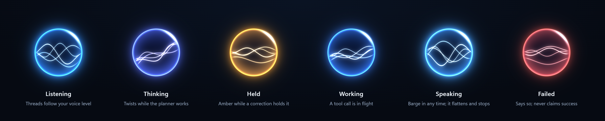
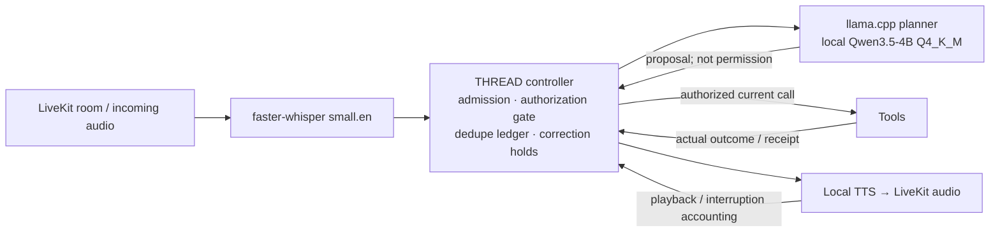

<p align="center"></p>
<h1 align="center">THREAD</h1>
<p align="center"><strong>Go on.</strong><br>A voice assistant you can interrupt and correct without losing the task.</p>

**Samsung PRISM 2026 · Theme 05 · ReflexAi, SRM Institute of Science and Technology Kattankulathur**

THREAD keeps a request's state as the user changes it. The planner proposes; the controller checks current authority before dispatch. A correction can replace work that has not executed. Interrupting speech cannot undo an accepted write: its actual outcome remains in the ledger.

## Launch film

https://github.com/user-attachments/assets/c765eb91-b9a5-40f6-8d59-505522d7d465

<sub>The 3-minute animated launch film; replies are re-voiced (see the [media provenance](docs/submission/media/README.md)). The full 1080p60 version is on the [release page](https://github.com/anshcantcode/thread-team-guide/releases/tag/PRISM_GENAI_HACKATHON_Y2026).</sub>

<p align="center"><br><sub>The same living orb in the browser, Kitchen and Android app. Every state is set by a real event: voice level, planner work, a held correction, a tool call, a barge-in, a failure.</sub></p>

**4 October submission refresh:** the final source is this repository's `main`, tagged `PRISM_GENAI_HACKATHON_Y2026`. Its benchmark runtime was measured on 4 October at development commit `4e88d4b`, whose runtime files are byte-identical to the tagged commit (hashes in the [run evidence](docs/fdb3/evidence/final-windows-20261004.json)): **63/100 strict tool passes** under the local diagnostic judge, with 100/100 recordings evaluated and zero infrastructure errors ([Results](#results)). The continuous demo take is still pending. Older releases, scores and films below are historical, not proof for that source. Owner-reported deadline: **4 October 2026, end of day**.

## Architecture


```mermaid
flowchart LR
  R[LiveKit room / incoming audio] --> W[faster-whisper small.en]
  W --> C[THREAD controller<br/>admission · authorization gate<br/>dedupe ledger · correction holds]
  C --> P[llama.cpp planner<br/>local Qwen3.5-4B Q4_K_M]
  P -->|proposal; not permission| C
  C -->|authorized current call| T[Tools]
  T -->|actual outcome / receipt| C
  C --> S[Local TTS → LiveKit audio]
  S -->|playback / interruption accounting| C
```

Speech onset fences stale work before transcription finishes. The controller rechecks freshness at execution, retains accepted outcomes and does not blindly retry unknown writes. Benchmark tools are the upstream **12 mock tools**. Kitchen uses real client-owned storage through a separate WebSocket PCM transport. [Architecture and source map](docs/ARCHITECTURE.md).

## Run the benchmark (organizers)

> **One-command install/configure/infer/evaluate, after prerequisites:**
> `bash scripts/reproduce_fdb3_linux.sh`
>
> Linux x86_64/glibc 2.28+, Python 3.11, Git/build tools, NVIDIA **48 GB** target with compatible CUDA/cuDNN, FFmpeg, espeak-ng, curl, sha256sum, setsid and flock; the released data ZIP and local LiveKit server are supplied separately. Full clean Linux/GPU qualification of the final source is still pending.

```bash
export THREAD_FDB3_ARCHIVE=/absolute/path/fdb_v3_data_released.zip
export LIVEKIT_SERVER=/absolute/path/livekit-server
export THREAD_FDB3_JUDGE_MODE=local
bash scripts/reproduce_fdb3_linux.sh
```

**Model/provider:** self-hosted llama.cpp b10930, Qwen3.5-4B Q4_K_M; local faster-whisper `small.en`; local espeak-ng (Linux) or SAPI (Windows diagnostic); local LiveKit. **No hosted provider or API key is required for this local route; INR 0 paid API use.** Model/data downloads and existing hardware are prerequisites, not bundled compute. Pins and runtime flags are in [the candidate manifest](config/fdb3-candidate.json); declared seed **42**, planner temperature **0**. Historical measurements with no explicit seed keep that identity.

> **OFFICIAL-JUDGE HANDOFF — organizers must select this explicitly.**
> The command above uses **local Qwen diagnostic judging**, even when upstream requests the alias `gpt-4o`. It is **not an official score**. The existing hosted route requires `THREAD_FDB3_JUDGE_MODE=hosted`, `THREAD_FDB3_HOSTED_JUDGE_AUTHORIZED=1` and an organizer-supplied `OPENAI_API_KEY`, with a caller-managed finite budget. The organizer must supply/confirm its pinned judge endpoint/model snapshot; the script's `gpt-4o` label does not pin that snapshot. Do not silently substitute Qwen or assume a hosted call is official. Follow the [exact organizer handoff and limitations](docs/fdb3/REPRODUCE.md#official-judge-handoff-organizer-controlled). THREAD has not authorized or run paid judging.

The runner verifies pinned inputs, creates fresh evidence and invokes all three evaluators. Exit **0** = all required checks/strict cases passed; **1** = complete run with non-passes; **2** = incomplete infrastructure/evaluation. [Full setup, assets, seeds, logs and exit semantics](docs/fdb3/REPRODUCE.md).

## Kitchen — real extension, separate from benchmark mocks

Kitchen reads, adds and checks actual checklist items in browser/Android storage. A receipt is persisted with the effect. Reconnect keeps the list but establishes fresh conversation authority. The PC hosts the model; this is **not standalone on-device inference**, a Samsung service integration or a physical-device qualification claim.

1. Follow [exact Windows setup](docs/SETUP.md#browser-kitchen) to install the locked environment, verify/download models and start the local planner.
2. Start `python scripts/serve_fdb3_clients.py --whisper /path/to/whisper-small-en` from that environment. Open **http://127.0.0.1:8768** and select **Connect and talk** (or **Connect to type**).
3. [Read, correct a request, inspect its receipt and reconnect](docs/TOUR.md). For the required evidence take use the [continuous 3–5 minute runbook](docs/submission/DEMO_RUNBOOK.md), including its failure path.

## Results

| Final-source evidence | Source / config / seed | Actual judge | Result |
|---|---|---|---|
| Full 100-recording run `20261003T192003Z-cf861d7d`, 4 Oct 2026 (Windows 11, RTX 4050 Laptop 6 GB, local LiveKit room) | `4e88d4b`; Qwen3.5-4B Q4_K_M; small.en; seed 42; temperature 0 | Local Qwen3.5-4B, **diagnostic** (upstream alias `gpt-4o` requested) | **63/100 strict tool passes**; 79/100 spoken answers judged correct; 58/100 both; 100/100 evaluated; **0 infrastructure errors** |
| Organizer rerun | Organizer-selected final source and pinned judge | Organizer-controlled | **PENDING — official score unknown** |

| Measure (same run) | Result |
|---|---|
| Strict tool pass by domain | ecommerce 19/29 · finance 23/25 · housing 8/26 · travel 13/20 |
| Upstream metrics, 100 turn-taken recordings | tool selection F1 **94.0%** · argument accuracy **69.8%** · response quality **79.0%** |
| Latency, upstream analyzer with the local judge (diagnostic) | first response **10.15 ± 3.43 s** (median 9.22, N=100) · first tool call **5.57 ± 1.63 s** (N=97) · task completion **11.50 ± 5.03 s** (N=100, none negative) |
| Wall time | 2 h 5 min for 100 recordings, including evaluation and latency analysis |

**Where the 37 misses come from.** The [per-case failure dossier](docs/fdb3/evidence/final-windows-20261004-failures.md) assigns each miss one primary layer: the planner chose a wrong value or skipped a call (13, one unclassified); the controller held or superseded a proposed call (8); the expected argument is not in the published contract (7); the value was right but its form differed under strict matching (5); recognition misheard a value (4). [Curated run evidence and hashes](docs/fdb3/evidence/final-windows-20261004.json).

**Contract gap (owner decision: no undeclared parameters).** Six housing recordings expect `search_apartments(..., pets_allowed=True)`. Neither the reference declaration in `contract/cascaded_agent.py` nor the mock signature in `contract/mock_apis.py` declares `pets_allowed`; the mock only tolerates it through `**kwargs`. THREAD sends declared parameters only, so these six cannot pass as specified. The name appears only in the released answer key, so adding it would tune the agent to the test set. Where the mock does declare a wider type (`update_search_filter.value: Any`), THREAD now sends native numbers and booleans (`1800`, `true`); this turned 056 and 061 into passes.

**Run-to-run movement.** The previous full run on `aebf6b3` also scored 63/100. Against it, this run gained 003, 045, 048, 056 and 061 and lost 010, 027, 038, 093 and 099. None of the lost cases involves `update_search_filter`, the only tool whose sent values changed. They fail on a misheard value (038: "euros" heard as "ROSE"), a dropped price, a date sent in ISO form, or a call the controller held. This is one run, not a variance estimate. A Qwen3.5-9B Q3_K_S planner screened on 52 hard cases scored 14/52 against 15/52 for the 4B under the same judge, so the 4B stays.

Strict tool pass, response quality, their intersection, coverage and infrastructure errors are separate measures. A changed source does not inherit a score.

**Historical only:** [the committed 30 September results](docs/submission/RESULTS.md) record local-Qwen strict tool passes of **59/100** (`771981a`, small.en), **64/100** (`771981a`, larger-ASR experiment) and **61/100** (`8dd530f`, small.en), and the fresh 3 October Linux one-command run scored **61/100** at `8ef5b59`. These are neither final-source results nor Samsung scores. [Older 29 September measurements](docs/fdb3/RESULTS_20260929.md) retain their distinct run/source identities.

**Run-log / failure-analysis deliverable:** [per-case dossier tool](scripts/fdb3_case_dossier.py) produces a timeline of heard fragments, raw proposals, gate decisions, actual calls, speech and evaluator verdicts for finished `fdb3_run.py` campaigns. See [commands and output locations](docs/fdb3/REPRODUCE.md#run-logs-and-per-case-failure-dossiers). It is evaluator-side analysis only; expected answers never enter the runtime. The [read-only demo evidence viewer](web/demo-evidence.html) displays existing journals, not simulated execution.

## Submission materials

| Material | Location / scope |
|---|---|
| Final eight-slide deck | [THREAD_Theme05_Deck_20261004.pptx](docs/submission/THREAD_Theme05_Deck_20261004.pptx): the team's 30 September shared design with the results from run `20261003T192003Z-cf861d7d`, current test counts and a companion slide (orb states, Watches, app actions) |
| Continuous final-source take | **Not yet recorded**; [exact runbook](docs/submission/DEMO_RUNBOOK.md) |
| Team, requirements, AI disclosure and human steps | [Submission index](docs/submission/README.md) |
| Historical edited media and original deck | [Media provenance](docs/submission/media/README.md), [original deck](docs/submission/SRMISTKtr_ReflexAI.pptx); not the new final-source take |

The [release](https://github.com/anshcantcode/thread-team-guide/releases/tag/PRISM_GENAI_HACKATHON_Y2026) for tag `PRISM_GENAI_HACKATHON_Y2026` carries this source's Android APK, browser bundle, source archive, evidence archive, deck, both films and `SHA256SUMS.txt`; `RELEASE-MANIFEST.json` records each file's hash and the tagged commit.

## Development and attribution

[Build/test commands and component boundaries](docs/SETUP.md#build-and-test) cover the controller, LiveKit SDK, browser and Android. Runtime lives in `participant/` and `thread_agent/`; the reproduction entry point is `scripts/reproduce_fdb3_linux.sh`. This documentation refresh changes no benchmark behavior.

Root [submission.yaml](submission.yaml), its Gemini key and the [legacy queue-kit archive](docs/submission/LEGACY_QUEUE_KIT.md) describe the **old** participant, not the local FDB-v3 reproduction contract. Required [AI disclosure](docs/submission/AI_DISCLOSURE.md) and [third-party attribution](THIRD_PARTY_NOTICES.md) remain; credentials and private runtime state are not submission assets.
