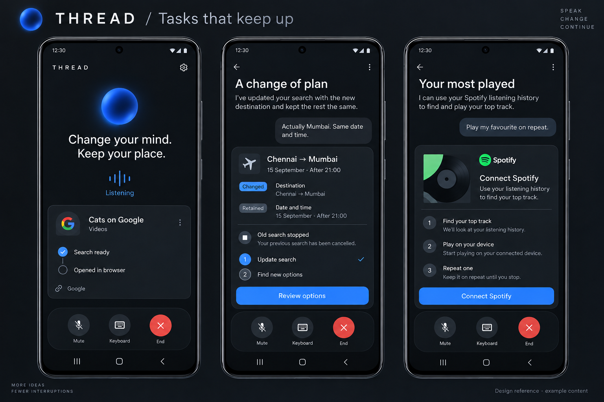

# Smart tasks — Android reference

Generated with the built-in ImageGen tool on 14 September 2026. The image is a design reference, not runtime evidence. Example cards do not establish Google loading, Spotify authorization or playback. Implementation uses native accessible Compose components and the existing sphere asset.

## Prompt

Use case: ui-mockup. Create a premium high-fidelity Android application reference board for THREAD, a real-time interruptible voice assistant. Landscape board with three large front-facing Samsung-style phone screens, crisp readable real UI, dark charcoal background, quiet flat tonal cards, restrained cobalt blue, warm-white text, generous spacing, subtle blue acoustic sphere as the existing product identity. No robot, no assistant avatars, no neon cyberpunk, no gradients on buttons, no decorative dashboard charts. Title outside phones: "THREAD / Tasks that keep up".
Screen 1: Voice screen with a small blue sphere, exact headline "Change your mind. Keep your place." and one rich task card titled "Cats on Google", subtitle "Videos", two concise steps "Search ready" and "Opened in browser", a small factual source "Google". Bottom native compact voice dock with mute, keyboard and end controls. Voice status "Listening". This is an app design, not a screenshot of a real account.
Screen 2: Ongoing task detail with title "A change of plan", user correction bubble "Actually Mumbai. Same date and time.", itinerary card "Chennai → Mumbai", retained date "15 September · After 21:00", small labelled changed destination and retained constraints, status "Old search stopped", 2-step progress, "Review options" flat blue button. Friendly unobtrusive task status, no giant confirmation modal, no raw API names.
Screen 3: Future Spotify integration state. Title "Your most played", request text "Play my favourite on repeat.", card with abstract record sleeve, state "Connect Spotify", explanation "Use your listening history to find your top track.", three small steps "Find your top track", "Play on your device", "Repeat one". Clear CTA "Connect Spotify". Do not falsely depict playback as already running. Bottom same compact voice dock. Add small board footer "Design reference · example content". Native typography, clear tap areas, high contrast, genuinely polished feasible Jetpack Compose layouts.

## Implementation interpretation

- Keep the existing dark palette, expressive sphere and native voice dock.
- Make current task state and the effect of a correction visible.
- Render completed actions only from controller/device/provider evidence.
- Keep Google handoffs distinct from verified page loading.
- Spotify connection is explicit; do not depict an unconnected account as playing.
- Reduce card text on the voice screen; retain details in an expandable task sheet.
- Generated brands and artwork are illustrative. Do not ship them as third-party brand assets.
