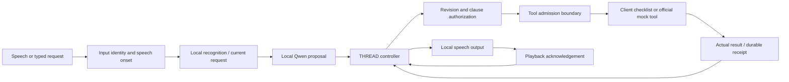

# Architecture

The planner proposes; the controller authorizes. Public schemas determine arguments. At source `4ef667e`, a read-only `search*` may leave eligible scalar, non-identifier filters unspecified when at least as many required filters are stated as omitted. The bridge passes `None` only for those unstated filters, without changing the public tool or evaluator. Guessed filters are removed; stated-but-dropped values and insufficiently constrained searches still require clarification. This exception never authorizes a write. See `participant/schema.py::unstated_search_filters` and `ControllerBridge._invoke`.

## State and correction

`ParticipantAgent` owns request state and revisions. Clauses retain identity so a value in an unrelated or retracted clause cannot authorize a write. Speech onset fences old work immediately, before recognition finishes. The LiveKit adapter tracks recognition segments and rejects stale transcript authority.

## Cancellation and outcomes

`ControllerBridge` separates dispatch intent from admission to execution. Work rejected before submission has no effect. Admitted work is accounted for until success, error or an unknown outcome. Unknown writes are not blindly retried. Late matching receipts update the original operation and retire its continuation; they do not start a new action.

## Browser and Android boundary

`fdb3_client.py` exposes a local-only host. Kitchen implements `read_checklist`, `add_checklist_item`, and `set_checklist_item`. The client owns storage, validates session/input/request identities, and persists an effect with its idempotent receipt. Browser data stays in its browser profile; Android data stays in private app storage. The network route does not expose test-reset, authority-setting or debug commands.

The host serializes conversations because its planner cache has one scenario owner. It rejects remote web origins and binds loopback. Android reaches it through explicit ADB reverse. This is a tethered extension, not an autonomous on-device model or an internet service.

## Speech evidence

Input is PCM16 mono at 16 kHz; output is PCM16 mono at 24 kHz. Only terminal playback events settle an SDK segment. Duplicate flushes and intermediate statuses cannot turn unheard audio into successful playback. Interrupted text is not proof that the user heard the unsaid suffix.

A playback receipt is a software estimate, not proof of human hearing. Benchmark transport is LiveKit WebRTC. Kitchen uses WebSocket PCM with a LiveKit AgentSession, so its latency is a separate measurement.

## Evaluation separation

The runtime reads the public tool contract. Evaluators read recordings, expected answers and grading code separately. This is process/input separation, not an OS-enforced sandbox; the stronger isolation gate remains unqualified. Official tools and evaluator semantics stay unchanged. Authored fixtures and local judgments are distinct from organizer results.

## General repairs included in 1.0.0

An omitted argument and the same explicitly supplied schema default now identify the same write effect. This closes a duplicate path while an earlier outcome remains unknown. The arguments actually sent to the tool remain unchanged; a genuinely different value is a different effect.

When a required argument is missing outside the limited read-only search rule above, THREAD asks a natural question using the contract's description. It does not invent benchmark-specific defaults or expose internal underscore-separated field names in speech. Independent tests include alternative schemas and control cases.

## 3 October source boundary

The catchup branch also repairs write authorization for supported conditional/sequenced requests and returned identifiers; it does not bypass the execution gate. These changes are outside the historical `8dd530f` measurement. Final-source results: [README results](../README.md#results).

## Read the implementation

| Stage | Source |
|---|---|
| Task state, dispatch and effect ledger | `participant/agent.py` |
| Clause-level authority | `participant/authorization.py` |
| Public-schema validation and declared defaults | `participant/schema.py` |
| LiveKit bridge and admission fence | `thread_agent/fdb3.py` |
| Recognizer and speech/session adapters | `thread_agent/fdb3_voice.py` |
| Browser/Android host boundary | `thread_agent/fdb3_client.py` |
| Native client and persistent checklist | `android/app/src/main/java/com/thread/app/Fdb3Activity.kt` |

The original Gemini mode has a separate live transport in `thread_agent/live.py`. Its camera permissions and playback accounting are included in the native and browser builds, but it is not the measured FDB-v3 local-model path.
