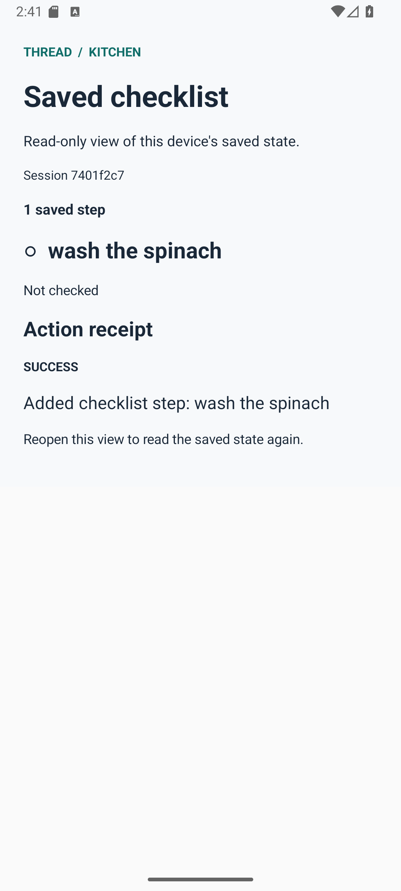

# Visible Android persistence — extension-audio015

**One fresh preregistered correction run passed with a visible native checklist.** The agent made exactly one successful `add_checklist_item` call with `text="wash the spinach"`, and made no celery write. The new read-only viewer showed that actual saved item and its real success receipt. Force-stop, native restart readback, and reopening the viewer confirmed persistence. The viewer did not change the stored preferences.



This image is an unedited capture from the actual owned emulator after restart. It is not generated artwork, a seeded demonstration screen, or a representation of a different run. The accompanying [machine-readable summary](evidence/extension015-summary.json) contains the screenshot, APK, source and raw-evidence hashes. [013/014 evidence](EXTENSION_RETEST_20260928.md) remains intact, including the failed 013 attempt.

## What changed

`Fdb3ChecklistViewerActivity` is a separate debug Activity using native text views. A validated `session_id` selects the existing `fdb3-<session>` private preferences; an optional validated `request_id` selects one stored native receipt. The viewer reads actual checklist text, checked state, receipt status and receipt detail. It does not dispatch tools, edit preferences, call a model, or infer a receipt from what the screen is expected to show. Unknown or invalid sessions display an explicit empty/error state.

The headless `Fdb3ExtensionActivity`, its native store, desktop controller and planner were unchanged. The viewer refreshes when reopened/resumed. It is a small inspection view for the tethered extension, not a standalone Android speech agent.

Identity for this run:

| Artifact | Identity |
|---|---|
| Frozen desktop voice runtime | `fecb5c221e2609e39799b87627e1f7327a54da89` |
| Android viewer source | `8e9324ab74d84c3a77c47e278702a6a066a1bf41` |
| Installed APK SHA-256 | `893ca1cf92fab41b9ad33fa0314f52da507d30b390d49054693e15be1bf5076f` |
| Original correction audio SHA-256 | `97b5babb91f47021a6559954c73c936f485dc008b1991817fe63eee910f97443` |

The installed APK hash was read back from the emulator and matched the built file. Its build worktree also contained unrelated work in progress; the summary scopes the source claim to the recorded Android files. The APK's bundled Python was not executed by this test: the voice/controller process used the separate frozen desktop checkout. This is not evidence for the evolving submission candidate's desktop runtime.

## Verification

- APK and test APK assembled successfully with offline Gradle, two workers, no daemon, and a 1536 MiB heap.
- **7 JVM tests passed**, with no failures, errors or skips.
- **5 native instrumentation tests passed**: the three existing extension store tests and two new viewer tests. The viewer tests verify actual stored item/receipt display, no preference mutation across Activity recreation, and truthful unknown/invalid session handling.
- **015 ran once**, with the same authored audio and frozen runtime/configuration as 014. Runtime status was `diagnostic_completed`, exit 0, with zero runtime errors and unchanged source hashes.
- Actual private-storage readback after app force-stop/native restart found one unchecked `wash the spinach` item. The viewer's actual accessibility hierarchy contained that item, `1 saved step`, `SUCCESS`, and the stored receipt text. Preferences before/after opening the viewer were equal.

The observer waited for the actual finished native add receipt before opening the viewer with that receipt's real IDs. The viewer finished opening at `2026-09-27T21:10:34.700914Z`; the first detected received speech signal began at `2026-09-27T21:10:38.583024Z`. Thus the visible result was displayed before the captured assistant speech. Observation did not inject an item, receipt or tool response.

TTS requested the actual native receipt text, `Added checklist step: wash the spinach`. The 43.29-second received WebRTC WAV includes silence and was locally transcribed as `added checklist step, wash the spinach.` The original synthetic input lasts 11.0695 seconds. The silent screen recording, original input and received output are retained separately with timestamps; any edited demo must label its assembly and preserve these originals. No human listening review is claimed here.

Worker wall time was 69.175 seconds, with four local model requests, three input transcriptions, one output transcription, and one SAPI synthesis. This single control with screen observation is not a controlled latency comparison or an official benchmark metric. Paid requests: **0**.

## Inspect the actual saved session

After a diagnostic run and before its cleanup, use that run's real receipt values:

```text
adb -s emulator-5560 shell am start -W -n com.thread.app/.Fdb3ChecklistViewerActivity --es session_id <result.session_id> --es request_id <actual-native-receipt.request_id>
```

The read-only viewer will not recreate a cleaned session. A fresh run requires a new preregistration and fresh evidence directory; do not reuse 015's final screen as evidence for a different run or source revision.

Retained raw evidence is in the ignored `.thread-run/raw` directory of the `thread-fdb3` worktree:

- `extension-audio015-preregistration.json`, `extension-audio015-execution.json`, and `extension-audio015/result.json`.
- `extension-audio015/verification.json`, `viewer-verification.json`, `viewer-hierarchy.xml`, and `prefs-after-viewer.xml`.
- `extension-audio015-viewer-live.png`, `extension-audio015/viewer-after-restart.png`, `extension-audio015-real.mp4`, and `extension-audio015/spoken.wav`.
- `extension-audio015-observation.json` and `extension-audio015-screenrecord.json` for original capture timing.
- `extension-audio015-cleanup.json`, `extension-audio015-cleanup-session.json`, and `extension-audio015-shutdown-verified.json`.

Session cleanup succeeded, owned emulator shutdown returned 0, and the final adb/process check found no owned emulator, observer or extension worker. The GPU was released. Shared services and all preceding raw attempts were preserved.

This is a reused authored SAPI tuning control on a tethered emulator. Physical-device, live-microphone and human-interruption evidence remain unproven, as do timer behavior and current-candidate runtime validation. The visible persistence control is now reviewable; **G7 and the overall submission are not declared complete** by this report.
